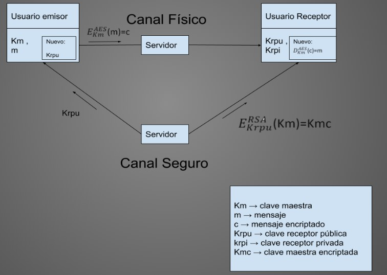
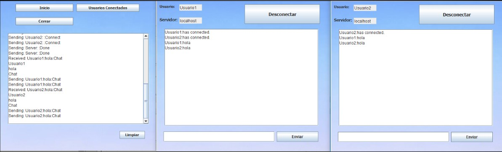

# SafeTalk

SafeTalk is a message app that allow the user to create a room and send messages to the other users in the room. The users can join the room if they have the password.

The app was made with *Java* and *JavaSwing*

This project is more about encryption and security than just a simple message system. 

---

## Encryption scheme

In this app we use sockets to send the encrypted messages, we created our own protocol to implement that. 

The first user to join the room generates the **AES** key and everytime the user wants to send a message this will be encrypted with the recipient's public **RSA** key and later decrypted with his private **RSA** key. We also use **AES** to encrypt public **RSA** keys

---

## Interface

[Documentation](https://docs.google.com/document/d/1gHDph4eBpoUr4uUeS9L4xAH6Vrrm-0J1b08czsDfrMg/edit?usp=sharing)
